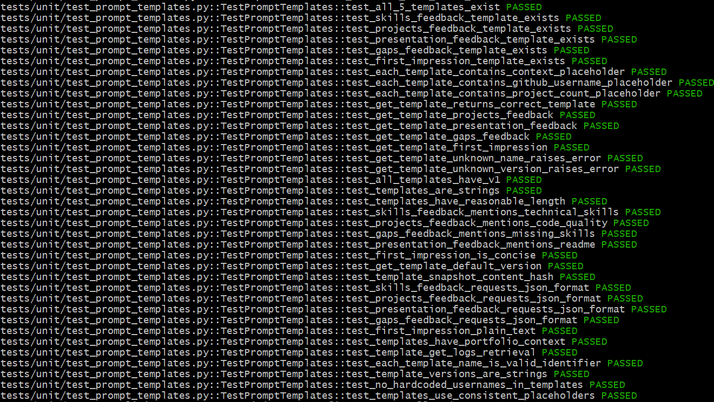
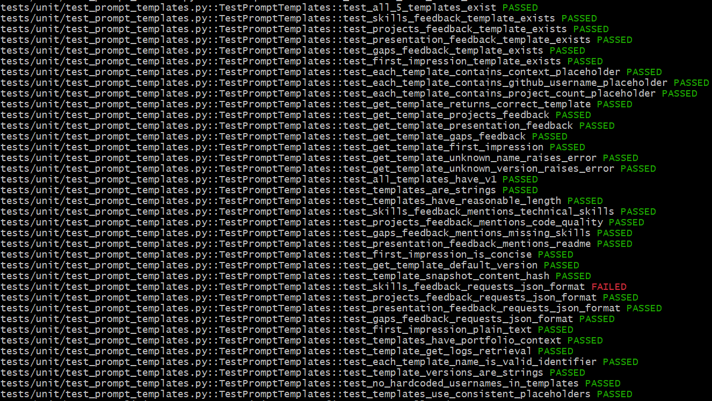

## Week 7 — Issue selection

**Issue link:** https://github.com/ascherj/pathreview/issues/37

**Issue title:** Add snapshot tests for prompt templates to catch accidental changes

**Tier:** [Yes] Tier 1  [ ] Tier 2  [ ] Tier 3

**Problem summary:**
Currently, LLM prompt templates can be silently changed, which can heavily impact the quality of resume reviews. So, a test that will compare the current prompt template string to a stored prompt template string (a snapshot) should be made. 
If there are changes and the version was not adjusted accordingly, this snapshot test should fail. If there are changes and an updated version, the test should pass. If there are no changes and no version change, this test should pass. If there are no changes and a version change, my assumption is that this test should still fail for incorrectly bumping up the version.

**Branch name:** test/37-snapshot-tests-for-prompt-templates

**Setup confirmation:** [Yes] App runs locally at localhost:5173

**Cohort ledger:** [N/A] Issue added to cohort ledger (I am a TF)

---

### Reproduction/Confirmation of Issue:

Before (In bash, run "make test-unit" and check for test_prompt_templates.py):

All the tests were passing for test_prompt_templates.py

After (after temporarily altering the prompt templates heavily without changing the version):

Most tests for test_prompt_templates.py pass except a JSON format test. This is because I removed the entire section for the JSON format request in one of the prompt templates. Aside from this, the prompt template changes I made were nearly undetectable. Smaller, more subtle changes without version updates would be much harder to trace. This requires the need of another unit test.

---

## Week 8 — Reproduction & solution planning

**Reproduction commit link:** https://github.com/EshaM3/pathreview/commit/d290dad2d956a1cea513ad61a4a1296e9ce2b1c6

**Reproduction summary:**
I ran all the test_prompt_templates.py unit tests to see them all passing. Then, after temporarily removing a bunch of text, I ran it again to see all except one test still passing. This showed to me that such a big change was barely traceable, so this was a problem for even more subtle prompt template changes.

**PLAN.md link:** https://github.com/EshaM3/pathreview/commit/86874a512bbaa838572e6076a68a74a024c32216

**Blockers or open questions:**
Will need to think on how to make a script to generate a file, as I don't recall doing that before.

---

## Week 9 — Solution building & PR submission

### Check-in 1 (mid-week)

**Current progress:**
I have completed all the subtasks from PLAN.md.

**Next steps:**
I will create and fill out the PR for this test enhancement.

**Blockers:**
None.

---